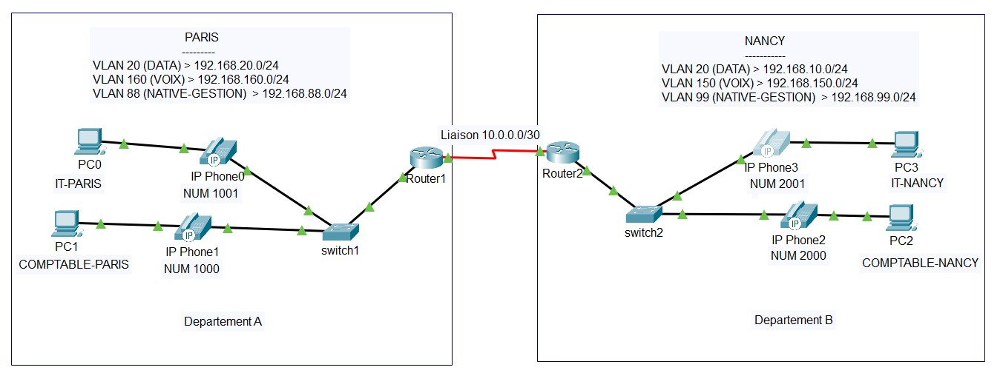

# ToIP Paris ↔ Nancy



## 1.  Contexte du projet
L’entreprise **EuroCom** possède deux départements distants :  
- **Département A** situé à **Paris**  
- **Département B** situé à **Nancy**

Chaque site dispose :
- D’un **réseau de données** pour les PC
- D’un **réseau voix** pour la téléphonie IP (ToIP)
- D’un **réseau de gestion** pour l’administration des équipements

L’objectif est de mettre en place une **infrastructure ToIP** permettant :
- La communication interne (PC ↔ PC, téléphone ↔ téléphone)
- La communication téléphonique entre Paris et Nancy via VoIP
- L’attribution automatique des adresses IP via DHCP

---

## 2. Besoin de l’entreprise
- **Centraliser la gestion** des adresses IP (DHCP sur les routeurs)
- **Séparer les flux** voix et données (VLAN dédiés)
- **Assurer la communication inter-sites** via une liaison série
- **Mettre en place un plan de numérotation** pour les téléphones IP :
  - Paris : 1000, 1001
  - Nancy : 2000, 2001

---

## 3. Prérequis

### Matériel
- 2 × Routeurs Cisco 2811
- 2 × Switchs Cisco 2960
- 4 × Téléphones IP Cisco 7960
- 4 × PC
- 1 × Câble série DCE/DTE
- Câbles Ethernet droits

### Logiciel
- Cisco Packet Tracer (version 8.x ou supérieure)

---

## 4. Table d’adressage

| Site   | Interface         | VLAN / Réseau       | Adresse IP        | Masque           | Passerelle       |
|--------|------------------|---------------------|-------------------|------------------|------------------|
| Paris  | S0/0/0            | Liaison série       | 10.0.0.1          | 255.255.255.252  | -                |
|        | Fa0/0.20          | VLAN 20 (DATA)      | 192.168.20.1      | 255.255.255.0    | -                |
|        | Fa0/0.160         | VLAN 160 (VOIX)     | 192.168.160.1     | 255.255.255.0    | -                |
|        | Fa0/0.88          | VLAN 88 (GESTION)   | 192.168.88.1      | 255.255.255.0    | -                |
| Nancy  | S0/0/0            | Liaison série       | 10.0.0.2          | 255.255.255.252  | -                |
|        | Fa0/0.10          | VLAN 10 (DATA)      | 192.168.10.1      | 255.255.255.0    | -                |
|        | Fa0/0.150         | VLAN 150 (VOIX)     | 192.168.150.1     | 255.255.255.0    | -                |
|        | Fa0/0.99          | VLAN 99 (GESTION)   | 192.168.99.1      | 255.255.255.0    | -                |

---

## 5. Étapes de configuration (avec commentaires)

### Exemple : création VLAN sur un switch
```bash
vlan 20                  # Création du VLAN DATA
 name DATA
vlan 160                 # Création du VLAN VOIX
 name VOIX
vlan 88                  # Création du VLAN GESTION
 name NATIF_GESTION
```

### Exemple : configuration d’un port pour PC + VoIP
```bash
interface fa0/1
 switchport mode access   # Port en mode accès
 switchport access vlan 20 # VLAN DATA pour le PC
 switchport voice vlan 160 # VLAN VOIX pour le téléphone IP
```

### Exemple : sous-interface routeur pour inter-VLAN
```bash
interface fa0/0.20
 encapsulation dot1Q 20   # Encapsulation VLAN 20
 ip address 192.168.20.1 255.255.255.0
```

---

## 6. Configurations complètes

### 🔹 Switch S1 (Paris)
```bash
enable
conf t
hostname S1
vlan 20
 name DATA
vlan 160
 name VOIX
vlan 88
 name NATIF_GESTION
interface fa0/1
 switchport mode access
 switchport access vlan 20
 switchport voice vlan 160
interface fa0/2
 switchport mode access
 switchport access vlan 20
 switchport voice vlan 160
interface fa0/24
 switchport mode trunk
 switchport trunk native vlan 88
 switchport trunk allowed vlan 20,88,160
interface vlan88
 ip address 192.168.88.2 255.255.255.0
 no shutdown
ip default-gateway 192.168.88.1
end
wr
```

### 🔹 Switch S2 (Nancy)
```bash
enable
conf t
hostname S2
vlan 10
 name DATA
vlan 150
 name VOIX
vlan 99
 name NATIF_GESTION
interface fa0/1
 switchport mode access
 switchport access vlan 10
 switchport voice vlan 150
interface fa0/2
 switchport mode access
 switchport access vlan 10
 switchport voice vlan 150
interface fa0/24
 switchport mode trunk
 switchport trunk native vlan 99
 switchport trunk allowed vlan 10,99,150
interface vlan99
 ip address 192.168.99.2 255.255.255.0
 no shutdown
ip default-gateway 192.168.99.1
end
wr
```

### 🔹 Routeur Dep‑A (Paris)
```bash
enable
conf t
hostname Dep-A
ip dhcp excluded-address 192.168.20.1
ip dhcp excluded-address 192.168.160.1
ip dhcp pool DATA
 network 192.168.20.0 255.255.255.0
 default-router 192.168.20.1
 dns-server 8.8.8.8
ip dhcp pool VOIX
 network 192.168.160.0 255.255.255.0
 default-router 192.168.160.1
 option 150 ip 192.168.160.1
 dns-server 8.8.8.8
interface fa0/0
 no shutdown
interface fa0/0.20
 encapsulation dot1Q 20
 ip address 192.168.20.1 255.255.255.0
interface fa0/0.88
 encapsulation dot1Q 88 native
 ip address 192.168.88.1 255.255.255.0
interface fa0/0.160
 encapsulation dot1Q 160
 ip address 192.168.160.1 255.255.255.0
interface s0/0/0
 ip address 10.0.0.1 255.255.255.252
 clock rate 64000
 no shutdown
telephony-service
 max-ephones 10
 max-dn 10
 ip source-address 192.168.160.1 port 2000
ephone-dn 1
 number 1000
ephone-dn 2
 number 1001
ephone 1
 button 1:1
ephone 2
 button 1:2
ip route 192.168.0.0 255.255.0.0 s0/0/0
dial-peer voice 1 voip
 destination-pattern 2...
 session target ipv4:10.0.0.2
end
wr
```

### 🔹 Routeur Dep‑B (Nancy)
```bash
enable
conf t
hostname Dep-B
ip dhcp excluded-address 192.168.10.1
ip dhcp excluded-address 192.168.150.1
ip dhcp pool DATA
 network 192.168.10.0 255.255.255.0
 default-router 192.168.10.1
 dns-server 8.8.8.8
ip dhcp pool VOIX
 network 192.168.150.0 255.255.255.0
 default-router 192.168.150.1
 option 150 ip 192.168.150.1
 dns-server 8.8.8.8
